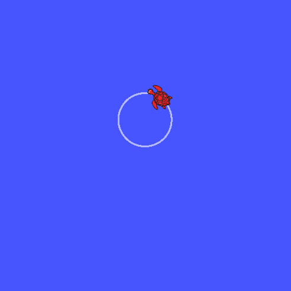

# Exercises

# Task 1

- Run the turtlesim node, and get the list of topics. Find the full name of the topic that ends with ```cmd_vel```.
- Find out the type of message of this topic.
- Get the message description (class attributes).
- Write a node that publishes on that topic to make the turtle move (any movement).
- Modify your node to make the trutle move in a circle. (Hint: tangential velocity = radius * angular velocity)

Note: the turtle can only move forward in the x direction, and rotate around the z-axis.



<details><summary>Solution, don't click if you didn't solve yet</summary>

```python
#!/usr/bin/env python

import rospy


from geometry_msgs.msg import Twist

rospy.init_node('commander')


pub = rospy.Publisher('/turtle1/cmd_vel', Twist, queue_size=10)

rate = rospy.Rate(100)


msg = Twist()

r = 1 #m
w = 1 #rad/s
v = r*w

msg.linear.x = v
msg.angular.z = w

while not rospy.is_shutdown():
    msg.linear.x = v
    pub.publish(msg)
    rate.sleep()


```
</details>