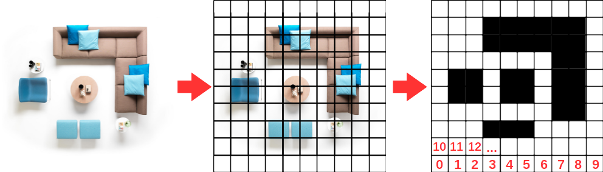

# Occupancy Grid Maps

- Occupancy grid maps are a popular map representation used in robotics. 


- An occupancy grid consists of cells, each cell represents an area in the environment. A cell can be occupied, free, or unknown.

 - An occupancy grid can be visualized as a grayscale image. In memory they are stored as an array of occupancy values. Each element in the array corresponds to a cell which represents certain area of the environment. 

- The example below shows a simple occupancy grid (a very coarse map just for demonstration):


On the left is the real environment, on the right end is the occupancy grid map that models/represents the environment.
 

In memory it could be stored as:
```python
 map data = [0, 0, 0, 0, ... , 0, 100 ,100 ,100 ,0 ,0 , ... ]
 ```
- Note that this array is not useful unless more information (meta information) is given about the map (such as the cell size or map resolution,     origin of map, size of map, etc..).