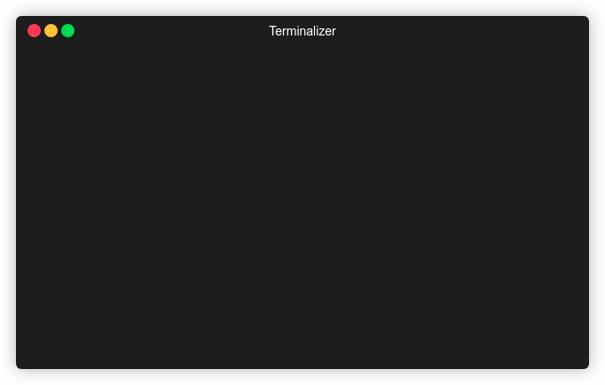

# Exercises


## Exercise 1

- Create a new package named: "my_third_package",  with `std_msgs`, and `rospy` as dependencies.


- Build your workspace.

Now, you are asked to create a `.action` file in your package. But first we need to create an `action` folder.

:bulb: Unlike messages and services, you can change the name of the action files folder, it doesn't have to be `action`. But the name you use should be the same when you add it to `CMakeLists.txt` later.

- Create a folder inside the package for our action files, and name it as: `action`.

- Create a `.action` file named "**MoveTurtle.action**". It should have the following fields:

  - **Goal**: one field of type `turtlesim/Pose`, name it `target_pose`.
  - **Feedback**: no fields.
  - **Result**: one field of type `turtlesim/Pose`, name it `base_position`.

  :dart: *You will later use it to create a node with an action server that receives a target pose, and controls the turtle  :turtle:  to reach it.*

##### Build instructions

The process is similar to what we did with service and message files. We need make changes on `package.xml`  (package manifest) file, and on `CMakeLists.txt`.

:speech_balloon: *the instructions are written in [mas-group/minimal_ros_packages/action_minimal](https://github.com/mas-group/minimal_ros_packages/tree/master/action_minimal) repository, but are rewritten here for convenience*


###### **`package.xml`**

- Add dependencies on message generation and `actionlib_msgs`:

```xml
<build_depend>actionlib_msgs</build_depend>
<exec_depend>message_generation</exec_depend>
<exec_depend>actionlib_msgs</exec_depend>
<build_depend>turtlesim</build_depend>
```


###### `CMakeLists.txt`

- add `actionlib_msgs` to `find_package()` under `COMPONENTS`. Also add any dependency. Example:

  ```cmake
  ...
  find_package(catkin REQUIRED COMPONENTS
    rospy
    std_msgs
    turtlesim
    actionlib_msgs
  )
  ...
  ```

- add `actionlib_msgs` to `catkin_package()` under `CATKIN_DEPENDS`

  ```cmake
  ...
  catkin_package(
     CATKIN_DEPENDS actionlib_msgs
  )
  ...
  ```

- add action file(s) (in this case [`Minimal.action`](https://github.com/mas-group/minimal_ros_packages/blob/master/action_minimal/action/Minimal.action):

```cmake
add_action_files(
   DIRECTORY action
   FILES MoveTurtle.action
 )
```

- generate messages with the appropriate dependencies (our action file depends on `turtlesim` package):

```cmake
generate_messages(
   DEPENDENCIES actionlib_msgs turtlesim
)
```

- `add_action_files()` and `generate_messages()` need to be called before `catkin_packge()`, else build will fail.

- Build your package.

- Let's invoke python interpreter and check if action messages have been generated successfully. Example:

  ```python
  Python 2.7.12 (default, Oct  8 2019, 14:14:10) 
  [GCC 5.4.0 20160609] on linux2
  Type "help", "copyright", "credits" or "license" for more information.
  >>> from my_third_package.msg import MoveTurtleGoal
  >>> goal = MoveTurtleGoal()
  >>> goal.target_pose.x = 2.0
  >>> goal.target_pose.y = 3.0
  >>> goal.target_pose.theta = 0
  >>> goal
  target_pose: 
    x: 2.0
    y: 3.0
    theta: 0
    linear_velocity: 0.0
    angular_velocity: 0.0
  >>> 
  
  
  ```

  

:bulb: Note how we import from `<package name>.msg`. Since ROS Actions are not part of `rospy` and they are built on top of ROS messages.


## Exercise 2

Let's send a goal to our action server. To do that we would write a client node first, but since `actionlib` is built on top of ROS messages, we could also publish a goal from the terminal.

- Create a `scripts` folder in your package (i.e. `my_third_package`), and put script [`00_action_server.py`](scripts/00_action_server.py) inside it.

- run ROS master and this node (make sure the script is executable).

- Try to see the list of topics.

- Try to publish on the goal topic, check result topic. Also try to publish on the cancel topic while the server is executing.  Example *(click <kbd>Tab</kbd> twice to auto-complete and show message fields)*:

  
  
- Modify the script if you need to (maybe add a delay, you can use the `sleep`  function from Python `time` module):

  ```python
  from time import sleep
  
  sleep(5.0) # delay of 5 secs
  ```


## Exercise 3

- Put script [`01_action_server.py`](scripts/01_action_server.py) inside the `scripts` folder of your package and run the node.
- From the terminal, subscribe for the feedback and result topics.
- And try different scenarios:
  - Publish a goal, wait until it finishes.
  - Publish a goal, and cancel it (publish on the cancel topics).
  - Publish a goal, while it's executing the action callback, terminate the server node (<kbd>Ctrl</kbd>+<kbd>c</kbd>).

:fire: Inside the `scripts ` folder, you will fi `utils.py` script which defines our `Turtle` class (It's the same script from previous session but with the `set_pen` method added to it).

- Modify the `Turtle` class by adding an action server which should drive the turtle :turtle: to a received goal pose, as follows:

  - rotate turtle so it's heading is in the same direction as the goal pose.
  - move turtle in straight line.
  - stop when it reaches the goal pose.

  :point_right: Save the node, you will use it in the next exercise.


## Exercise 4

- Create a node with an action client to the server you created in previous exercise, this node should publish goals to make the turtle move in a rectangular path.