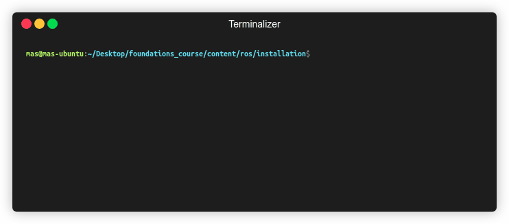

# Installation of ROS and catkin

:warning: Be aware that this script has been tested on Ubuntu 16.04.

## How to install
Please execute the `ros_catkin_installer.sh` in the ROS installation folder

Make sure to make it executable by:
```
$ chmod +x ros_catkin_installer.sh
```
Then execute as
```
$ ./ros_catkin_installer.sh
```



## Installation menu

You can choose between four options when executing the script (choose "Install everything" option if you don't have ROS yet):

### 1. Install ROS

This will install the following packages:

* ROS Kinetic Kame
* ROS Kinetic SMACH viewer (to visualize state machines)
* ROS Kinetic Map Server
* Python for ROS
* Python PySide (needed for GUI elements)
* Gnuplot (for plotting graphs)

After this it will ask you whether you want to add the command to source ```setup.bash``` in  your ```.bashrc``` file ([what is .bashrc file?](extra_info.md)). Choose "Yes" unless you have more than one ROS distibution and want to manually do this command.

Adding this command is needed so all ROS commands can be used from anywhere in the terminal and for auto-completion of commands. A backup will be created in the file .bashrc_before_ros. 

If you choose no, you will have to manually source ```setup.bash``` everytime you open a new terminal, as follows:

```
source /opt/ros/kinetic/setup.bash
```

### 2. Apply ROS bugfix

This includes two bugfixes:

1. This will change the installed stage.hh in /opt/ros/kinetic/include/Stage-4.1/.
The bugfix is necessary because of the problem described [here]. Because of a new string literal in C++ 11 this fix is needed.

2. This will also change the file joint.hpp in /opt/ros/kinetic/include/kdl/
This is needed because the None type in line 47 has already been defined in another header and needs to be undefined before executing this line. Here is a link to the [bug-report].

[here]: https://github.com/rtv/Stage/issues/64
[bug-report]: https://github.com/rtv/Stage/issues/64

### 3. Create Catkin workspace

For working with ROS you need a Catkin workspace. This will be created in your home folder under /caktin_ws/.

Do not install this if you already created a catkin workspace with this name.

Furthermore it will ask you if you want to add /catkin_ws/devel/setup.bash to your .bashrc. It will check if one is already present in your .bashrc and then add it so you can always execute the catkin related commands from anywhere in the terminal.

A backup of your old .bashrc is created under .bashrc_before_catkin

### 4. Install everything

This will go through steps 1-3 and install everything. If you don't have ROS installed yet this is the option to choose.
