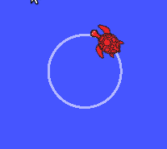

# Exercises

# Task 1

- Run the turtlesim node, and get the list of topics. Find the full name of the topic that ends with ```cmd_vel```.
- Find out the type of message of this topic.
- Get the message description (class attributes).
- Write a node that publishes on that topic to make the turtle move (any movement).
- Modify your node to make the trutle move in a circle. (Hint: tangential linear velocity = radius x angular velocity)

Note: the turtle can only move forward in the x direction, and rotate around the z-axis.



<details><summary>Solution (don't click if you didn't solve yet)</summary>

```python
#!/usr/bin/env python

import rospy
from geometry_msgs.msg import Twist

rospy.init_node('commander')
pub = rospy.Publisher('/turtle1/cmd_vel', Twist, queue_size=10)
rate = rospy.Rate(100)

msg = Twist()

r = 1 #m
w = 1 #rad/s
v = r*w

msg.linear.x = v
msg.angular.z = w

while not rospy.is_shutdown():
    pub.publish(msg)
    rate.sleep()
```
</details>

# Task 2

- Write a launch file to run two nodes of the turtlesim node, and a third node which is the script you wrote in task 1.


  


<details><summary>Solution (don't click if you didn't solve yet)</summary>

```xml
<!-- launch file to run two turtles and make then spin-->

<launch>
<node pkg="turtlesim" type="turtlesim_node" name="turtle1"/>
<node pkg="turtlesim" type="turtlesim_node" name="turtle2"/>
<node pkg="my_first_package" type="youScript.py" name="rename_it_as_you_want"/>

</launch>
```
</details>


# Task 3

- Write a launch file to run two nodes of the turtlesim node, and two nodes of ```07_parameters_example.py``` script.

 - In the launch file, define required parameters such that the turtles rotate at different speeds and radii

:bulb: Hint: You may need the group tag ```<group ns="namespace">```

  


<details><summary>Solution (don't click if you didn't solve yet)</summary>

```xml
<!--  launch file, two turtles spinning at different speed and radius-->

<launch>
<group ns="/first">
    <node pkg="my_first_package" type="07_parameters_example.py" name="commander">
        <param name="rate" value="100"/>
        <param name="radius" value="1"/>
        <param name="angular_speed" value="2"/>
    </node>
    <node pkg="turtlesim" type="turtlesim_node" name="turtle"/>
</group>  


<group ns="/second">
    <node pkg="my_first_package" type="07_parameters_example.py" name="commander">
        <param name="rate" value="100"/>
        <param name="radius" value="0.5"/>
        <param name="angular_speed" value="1"/>
    </node>
    <node pkg="turtlesim" type="turtlesim_node" name="turtle"/>
</group>    
    
    
</launch>
```
</details>