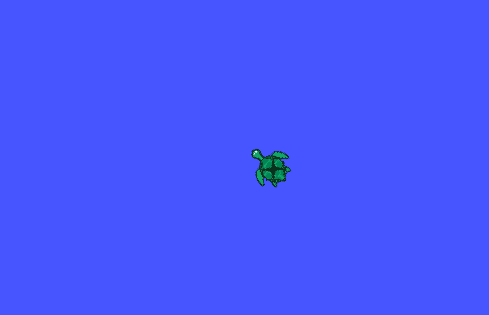

# Exercises


## Exercise 1

- Run the master (```roscore```), and the turtlesim node:

  ```bash
  rosrun turtlesim turtlesim_node
  ```

- Find out available services:

  ```bash
  rosservice list
  ```

- Pick any service and find out it's type:

  ```bash
  rosservice info <service name>
  ```

- Find out the service description:

  ```bash
  rossrv show package/srv
  ```

  Example:

  ```
  rossrv show turtlesim/SetPen
  ```

- Try to call the service from the terminal:

  ```
  rosservice call <service name> <request>
  ```

  Example:

  ```bash
  rosservice call /turtle1/set_pen "{r: 255, g: 0, b: 0, width: 2, 'off': 0}"
  ```


## Exercise 2

- Create a new package named: "my_second_package",  with `std_msgs`, `rospy` as dependencies.
- Build your workspace.
- Create a folder inside the package for our service files, it must be named as: `srv`. *(ignore this step if you already had)*
- Create a `.srv` file for our useless node, it should have a string field in both the request and reply. Name it as "**Talk.srv**"
- Create a second `.srv` file named: "**CellCheck.srv**". It should have the following:
  - Request: should have one field of type: `geometry_msgs/Point`, name it as: "**location**".
  - Reply: should have two fields:
    -  "**value**" field of type: `int8`.
    -  "**result**" field of type: `string`.


## Exercise 3

- Write a node that changes the color of the :turtle: to look like below:

*Hint: you can send velocity commands to the turtle using the `turtle_teleop_key`, it reads from the keyboard (<kbd>←</kbd><kbd>↑</kbd><kbd>↓</kbd><kbd>→</kbd>) and sends velocity commands accordingly:*

 ```
rosrun turtlesim turtle_teleop_key
 ```





## Exercise 4

- Modify the `Turtle` class (from yesterday's session) defined in `scripts/utils.py` to add the following:

  - **a server** for robot cleaning service: the service is of type `std_srvs/SetBool`. When a call is received, the :turtle: should start the cleaning routine if `SetBool.data`  is `True`, otherwise, the :turtle: should stop. 

    *Cleaning here is just making the turtle move in random fashion with pen color set to white and width of 10.*

  - **a service client**  to set the pen color of the turtle. Make a class method ```set_pen``` such that when called it should make the service call. Example usage:

    ```python
    turtle1 = Turtle(1)
    turtle1.set_pen(255,0,0,3,0)
    ```

:bulb: Hint: first, take your time to read the class, all the methods, the constructor, etc.., then add the service client and server. If you have doubts about class syntax in Python, ask us directly.


## Exercise 5

You are asked to build the service files you wrote in **Exercise 2**:

- Make sure the files are inside the `srv` folder in your package, i.e. :

   `my_second_package/srv/Talk.srv`

  `my_second_package/srv/CellCheck.srv`

- Make the needed changes to the manifest file `package.xml` of your package, which are:

  - Dependencies on message generation need to be added:

  ```xml
  <build_depend>message_generation</build_depend>
  <exec_depend>message_runtime</exec_depend>
  ```

  - The second `srv` file (**CellCheck.srv**) depends on `geometry_msgs`, and we haven't mention it among the dependencies when we first created the package (we only did for `rospy` and `std_msgs`). Therefore we need to add `geometry_msgs` to the dependencies:

    ```xml
    <build_depend>geometry_msgs</build_depend>
    ```

  :bulb: More details regarding build tags can be found in [Catkin documentation](https://docs.ros.org/kinetic/api/catkin/html/howto/format2/catkin_library_dependencies.html).

- Make the needed changes to the `CmakeLists.txt` file of your package:

  - add `message_generation` to `find_package()` under `COMPONENTS`. Also add any dependency. Example:

    ```cmake
    ...
    find_package(catkin REQUIRED COMPONENTS
      rospy
      std_msgs
      geometry_msgs # needed becuz we used it in CellCheck.srv
      message_generation
    )
    ...
    ```

    

  - add `message_runtime` to `catkin_package()` under `CATKIN_DEPENDS`. Example:

    ```cmake
    ...
    catkin_package(
       CATKIN_DEPENDS message_runtime
    )
    ...
    ```

    

  - add service files:

    ```cmake
    ...
    add_service_files(
      FILES
        file1.srv
        file2.srv
        file3.srv
        ...
    )
    ...
    ```

  - generate all your messages and services, specify dependencies if exist:

    ```cmake
    generate_messages(
      DEPENDENCIES
        std_msgs
    	geometry_msgs
    )
    ```

    :warning: `add_service_files()` and `generate_messages()` need to be called before `catkin_packge()`, else build will fail.

- Build your package.

- Implement the "useless" node by using the first service ("Talk"). Try to call the service from the terminal.


## Exercise 6

- Go to section **Foundation course tasks**  in the README file of this [repository](https://github.com/mas-group/minimal_ros_packages/tree/master/srv_minimal#foundation-course-tasks). (same one cloned yesterday), and do the tasks.